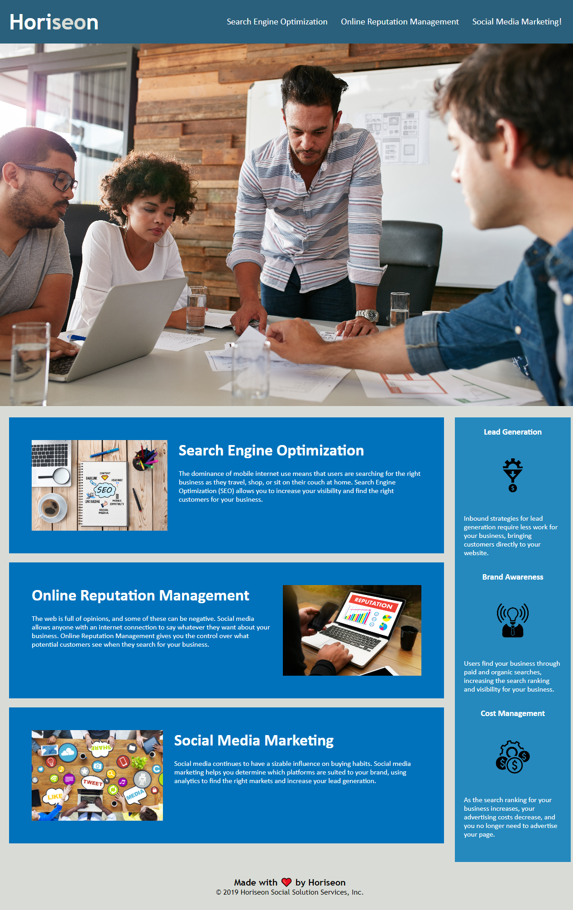

# module1-challenge

## Description

The goal with this repository is to improve the accessibility of a social media marketing webpage from Horiseon. Accessibility is extremely important, to not only be inclusive to all members of society but also for businesses to ensure that they able to reach a wider client base. Additionally, there can be legal implications if disabled people cannot access a site so there is even more incentive for companies to make their content fully accessible. 

I have acheived this by adding alt text to all the images, including background images using aria-label. Along with this I have updated the html semantics to make the page flow much easier to understand.

## Usage

This website can be used for social media marketing tips. Please see below screenshot of the main page. The following image shows the deployed website:

    
    
    

## Link to deployed application

https://pudders.github.io/horiseon-improving-accessibility/ 

## License

Please refer to the LICENSE in the repo.

